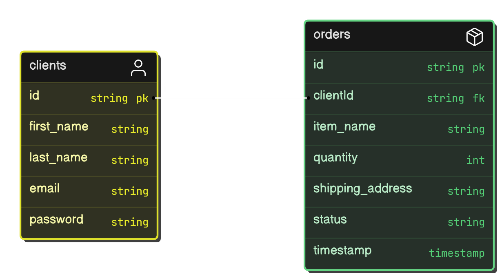

# Order Management API Platform


The Order Management API is a platform that allows clients to sign up, log in, place orders, cancel orders, and view their order history. It includes authentication and authorization using JWT (JSON Web Token) and is secured with Spring Security.

This platform is built using Spring Boot and MySQL, and it supports Docker for easy containerization and deployment.

## Functionalities

### Client Registration and Authentication:
- Clients can register by providing an email, password, first name, and last name.
- Clients log in using their email and password to receive a JWT token, which is used to authorize further requests.

### Order Placement:
- Clients can place orders by specifying:
    - **Item Name:** The name of the item to order.
    - **Quantity:** The number of items.
    - **Shipping Address:** Where the item(s) should be delivered.
- The system generates and returns an order reference number upon successful order placement.

### Order Management:
- Orders can be in one of the following states:
    - **NEW:** When the order is first placed.
    - **DISPATCHED:** Automatically updated by a background job that runs hourly to dispatch NEW orders.
    - **CANCELLED:** Clients can cancel the order if it is still in the NEW state.
- The system uses a Cron Job to update the status of all NEW orders to DISPATCHED periodically.

### Order History:
- Clients can retrieve their order history with support for pagination. They can specify the page number and the number of records per page.

### Order Cancellation:
- Clients can cancel an order if it is in the NEW state by providing the order reference number.

### Unit Test Cases:
- Unit tests are written to ensure the correctness of individual components in the system. These tests validate key functionalities such as:
    - Client registration and authentication.
    - Order placement and management.
    - Cron job execution for order dispatch.
    - Order history retrieval with pagination.
- The unit tests help maintain code quality and ensure that the application behaves as expected under various scenarios.
## Entity Relationship Diagram (ERD)

The following diagram illustrates the relationships between the `Client` and `Order` tables.


## API Endpoints

### Client Endpoints:
- **POST** `/api/v1/auth/register`: Register a new client.
- **POST** `/api/v1/auth/authenticate`: Authenticate and retrieve a JWT token.

### Order Endpoints:
- **POST** `/api/order/place-order`: Place a new order.
- **PUT** `/api/order/cancel-order?order_id={}`: Cancel an order if it is in the NEW state.
- **GET** `/api/orders/history?page={}&size={}`: Fetch order history with pagination (requires page and size query parameters).

## Security
- **JWT-based authentication:** All endpoints (except signup and login) require a valid JWT token in the authorization header.

## Technologies Used
- **Spring Boot** / Java
- **MySQL**
- **JPA (Java Persistence API)** for ORM
- **JWT (JSON Web Token)** for securing APIs
- **Spring Security** for authentication and authorization
- **Docker** for containerization
- **Cron Job** for automated order status updates
- **JUnit** for unit testing

## GitHub Repository
You can find the source code of this project on GitHub:  
[Order Management API Platform](https://github.com/SyThulasi/Order_Management_Api_Platform)

## Docker Link
You can find the Docker image and instructions here:

## Running the Application via Docker Compose

### Step 1: Set Up the `docker-compose.yml` File

The **docker-compose.yml** file can be found in the [GitHub repository](https://github.com/SyThulasi/Order_Management_Api_Platform).

### Step 2: Pull the Docker Image from Docker Hub

Run the following command to pull the Docker image from docker hub :

```bash
docker pull your-dockerhub-username/order-management-api:latest
```
### Step 3: Run the Application with Docker Compose
Once the docker-compose.yml file is in place, run the following command to start both services
```bash
docker-compose up
```
## Setup Instructions

1. **Clone the Repository:**
    ```bash
    git clone https://github.com/SyThulasi/Order_Management_Api_Platform
    cd order-management-api
    ```

2. **Set Up MySQL:**  
   Ensure MySQL is installed and running, then create the required database:
    ```sql
    CREATE DATABASE order_management;
    ```

3. **Configure the Application:**  
   Edit the `application.properties` file to configure your MySQL credentials:
    ```properties
    spring.datasource.url=jdbc:mysql://localhost:3306/order_management
    spring.datasource.username=your-username
    spring.datasource.password=your-password
    ```

4. **Run the Application:**  
   To run the application using Maven:
    ```bash
    ./mvnw spring-boot:run
    ```

5. **Access the API:**
    - **Sign-up:** `http://localhost:8080/api/v1/auth/register`
    - **Log in:** `http://localhost:8080/api/v1/auth/authenticate`
    - **Place an order:** `http://localhost:8080/api/order/place-order`
    - **Cancel an order:** `http://localhost:8080/api/order/cancel-order?order_id={}`
    - **Get order history:** `http://localhost:8080/api/orders/history?page=0&size=10`
